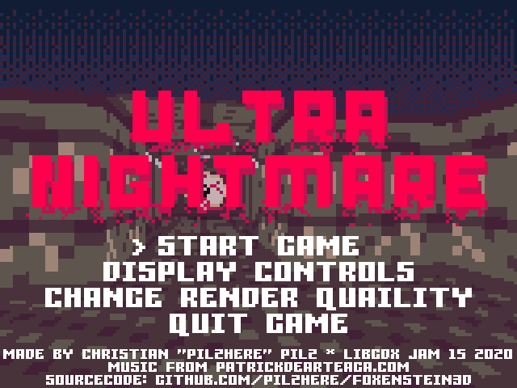

# Foxenstein3D

	 
The name of the project is Foxenstein3D. 
The name of the game is Ultra Nightmare.

## About
Ultra Nightmare is a first person shooter in the style of Wolfenstein3D. 
Made in one week, during the <b>libGDX</b> Game Jam 15 December 2020.
 
 

## Download release
[Itch.io](https://pilzhere.itch.io/ultra-nightmare)
 
 

## Contributors
*	### [PilzHere](https://github.com/PilzHere)
	* #### Main game developer
	* [christianpilz.com](https://www.christianpilz.com)
  
*	### [Raxorg](https://github.com/Raxorg)
	* Flashing enemies and camera vertical movement.
 

## What's next?
Check out the [to do list](readme/TODO.md).
